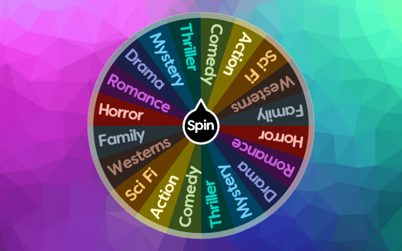
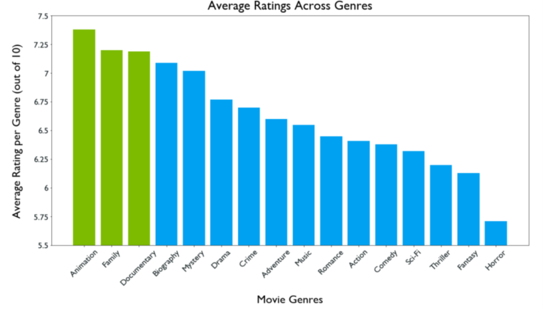
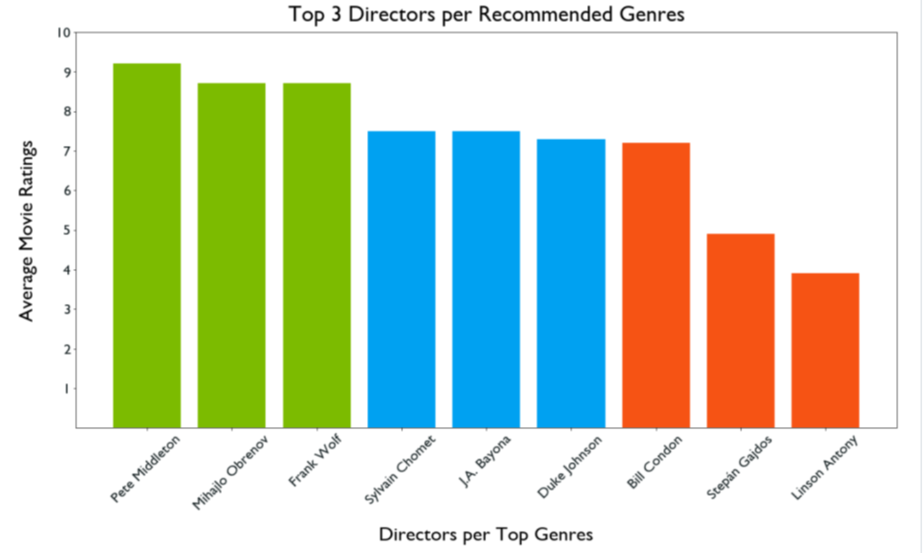
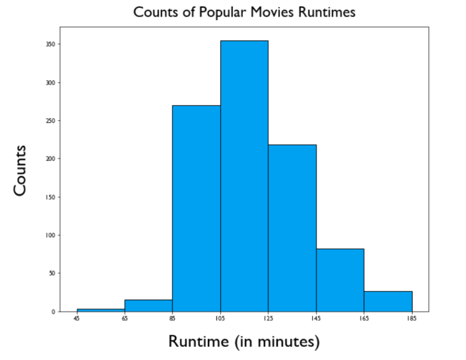

# Microsoft Movie Studios Analysis

**Authors**: Dermot O'Brien, Ziyuan Wang

## Overview

We have been tasked with providing the head of "Microsoft Movie Studios" three actionable insights that they can use to decide what kinds of films to make. To make these reccommendations, we must first gather movie data from reputable sources, clean the data properly, and analyze and vizualize our findings simply and effectively.

## Business Problem

Microsoft Movie Studios is a relatively new division that is looking to compete with the best movie makers in the business. To do this, they will first need to have a better understanding of their competitors successes and failures, the trends related to the kinds of movies that are successful, the types of movies that have high production costs and gross profits, etc. In this analysis, we hope to provide a clearer picture of the industry and target an area of focus for Microsoft Movie Studios to take advantage of.


## Data

To analyze the movie industry as a whole, we took data from the following sources:

* Box Office Mojo
* Rotten Tomatoes
* The Movie Database (TMDB)
* The Numbers
* Internet Movie Database (IMDB)

These datasets come from reputable sources in the movie industry and include insightful data points like movie ratings, genres, production budgets, gross profits, etc.




## Methods

We merged some of the datasets and filtered out some "bad" data, for example empty content in genre column or some zero ratings. After we get rid of those, we could start the analysis our data through different aspects.

## Results


As shown above, Documentary, Animation, Family are the highest rated genre's in IMDB's database. Note that we took the mean rating per genre because there were no clear outliers that would drastically skew the data.



The graph above shows the top directors in each recommended genre. For Family genre, it is interesting to note that there is a large gap in ratings between the first rank director and the other two. In this case, we will only recommend Bill Condon for the Family genre.



As shown above, the most frequent length of a popular movie falls between 105 and 125 minutes. We decided to bin our movies in 20 minute increments to give the movie studio a sizeable range to work with.

## Conclusions

This analysis leads to three recommendations for Microsoft Movie Studios:

* Create a film in either Animation, Family, or Documentary genre
* Choose a top rated director from one of the three genre's
* Keep the length of your movie(s) between 105 and 125 minutes long

## Next Steps
Given more time and money, we would be able to do the following:

Run a regressional analysis to evaluate what kinds of factors play a large part in the success of a film
* Examples: Impact of advertisement spending, % increase in profits from oscar nominations, etc.

Find more accurate relationships between ratings, budgets, and profits

## For More Information

Please review our full analysis in [our Jupyter Notebook](./final_project.ipynb) or our [presentation](./DS_Project_Presentation.pdf).

For any additional questions, please contact **Dermot O'Brien, & dermot.obri@gmail.com, Ziyuan Wang & zywang1994@gmail.com**

## Repository Structure

```
├── README.md                           <- The top-level README for reviewers of this project
├── final_project.ipynb                 <- Narrative documentation of analysis in Jupyter notebook
├── Presentation.pdf                    <- PDF version of project presentation
└── images                              <- images folder used for project
└── zippedData                          <- data folder used for project
```
